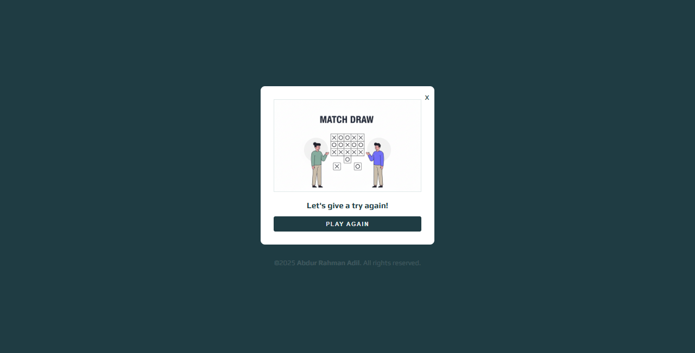

# **Tic Tac Toe – Modern JavaScript Edition**

A clean, responsive, and animated Tic Tac Toe game built using **HTML, CSS, and vanilla JavaScript**, featuring smooth animations, win-line effects, sound effects, and a modern UI.

---

## **Features**

* Interactive Gameplay (X vs O)
* Winning Line Animation
* Sound Effects (Win / Tie)
* Dynamic Modal for Win & Tie
* Full Reset System
* Responsive Layout
* Accurate turn switching and logic handling

---

## **Project Structure**

```
project/
│── index.html
│── style.css
│── script.js
│── assests/
│     ├── images/
│     │      ├── winner.png
│     │      └── tie.png
│     └── sound/
│            ├── win.mp3
│            └── aww.mp3
```

---

## **Technologies Used**

* HTML5
* CSS3
* Vanilla JavaScript

---

## **How It Works**

* Player clicks a box → X or O appears.
* Game checks:

  * Winner → Modal appears, sound plays, animated line displays.
  * Tie → Tie modal and sound.
* Reset button clears the entire board and restarts the game.

---

## **Game Logic**

* Predefined win patterns
* Dynamic turn switching
* Buttons disabled after winning
* Win-line positioned using transform values
* Tie detection with safety conditions
* Fully resettable game state

---

## **Preview**


```



```

---

## **Setup**

Simply download the project and open:

```
index.html
```

No dependencies or installation required.

---

## **Future Improvements**

* AI (Play vs Computer)
* Scoreboard System
* Theme Switcher (Dark / Light)
* Customizable sound and effects

---

## **Author**

**Abdur Rahman Adil**
Email: *abdurrahmanadil005@gmail.com*


---

## **License**

```
© 2025 Abdur Rahman Adil. All rights reserved.
```

